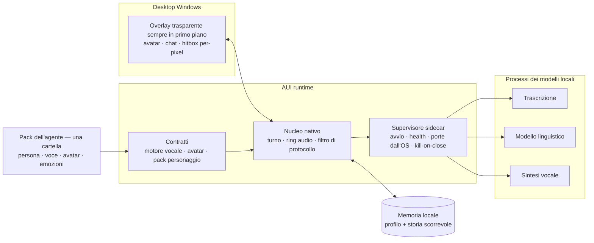
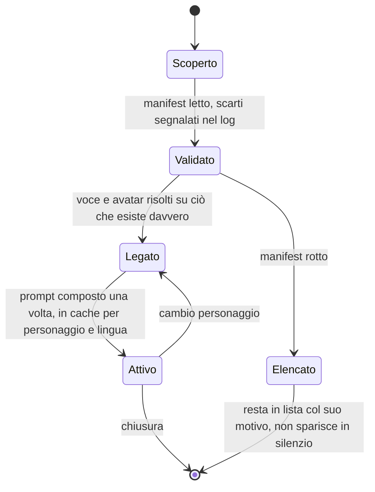
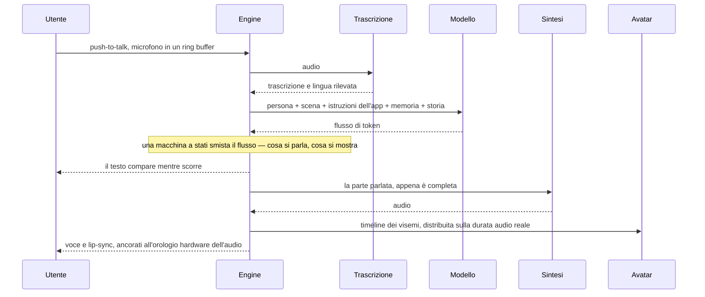
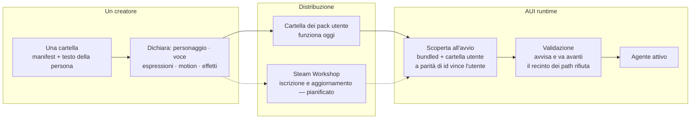

# Agentic User Interface Engine (AUI)

**Repository di sola documentazione. Il codice sorgente non è pubblico.**
*[English version](./README.md)*

> **Wallpaper Engine, ma per gli assistenti.** Wallpaper Engine non spedisce
> quasi nessuno sfondo suo: è la cosa che fa girare quelli che costruiscono gli
> altri, più un Workshop che li fa circolare. AUI è quello strato per
> l'assistente da desktop — il motore sotto il personaggio, non un altro
> personaggio.

---

## Cos'è

Il nome è la specifica, una parola alla volta.

- **Agentic** — quello che ci gira sopra è un agente, non un'immagine: ti sente,
  risponde con la sua voce, muove la faccia mentre parla e si ricorda cosa hai
  appena detto.
- **User** — gira sulla macchina di chi lo usa. La sua GPU, i suoi modelli, i
  suoi file. Nessun account, nessun viaggio verso il cloud, nessun abbonamento.
- **Interface** — l'agente è una cosa che si guarda e a cui si parla: un overlay
  trasparente sul desktop, una faccia, una voce, una finestra di chat. Non
  un'API, non un terminale.
- **Engine** — l'architettura di base, e niente sopra. Chi è il personaggio, come
  suona, come si vede, che espressioni ed effetti ha: quello è contenuto, e il
  contenuto è di chi lo fa.

Quindi un agente è una cartella, e il motore fa girare cartelle. Quella spedita
con l'app è **Mia** — la scena demo, come la spedisce un motore di gioco. Tutto
ciò che la rende *lei* vive in quella cartella e niente vive nell'app: metti
un'altra cartella accanto alla sua e sul desktop c'è il personaggio di qualcun
altro, con la sua voce e le sue espressioni, senza ricompilare niente.

**Cosa non è:** una raccolta di agenti AI, e nemmeno un framework per agenti
rivolto a sviluppatori. È lo strato sotto a entrambi — la parte che deve
funzionare prima che chiunque possa metterci il suo personaggio preferito.

Mia è il primo agente che ci gira sopra, ed è il prodotto in uscita su Steam.

> [DA INSERIRE] video demo da 20–30 s: un turno parlato — microfono, risposta,
> lip-sync. · [DA INSERIRE] screenshot dell'overlay su un desktop reale. ·
> [DA INSERIRE] clip da 15 s: lo stesso motore, due personaggi diversi.

---

## Il problema

Spedire un assistente è un'app. Farne una cosa su cui altri costruiscono è un
problema diverso, e sotto ci stanno quattro vincoli duri.

- **Una singola applicazione cabla un solo personaggio.** Cambiare voce,
  espressioni, faccia o modello vuol dire ricompilare — che è esattamente ciò
  che rende un assistente un'app invece di una piattaforma. È il motivo per cui
  esiste un engine.
- **Tre modelli, tre cicli di vita.** Trascrizione, modello linguistico e sintesi
  sono runtime separati con alberi di dipendenze incompatibili. Legati dentro lo
  stesso processo, un modello che muore si porta via la finestra.
- **La VRAM è il budget, ed è condivisa.** Un modello 4B a 4 bit occupa
  3.396 MiB su una scheda da 8 GB con 8k di contesto (misurato sotto). Quel che
  resta deve bastare al gioco nell'altra finestra.
- **L'orologio audio è un vincolo duro.** Il lip-sync è una timeline ancorata a
  ciò che gli altoparlanti hanno davvero riprodotto. Lo sfasamento si vede su una
  faccia prima di essere misurabile in un log.
- **Il desktop non è una finestra.** Un overlay trasparente sempre in primo piano
  decide, pixel per pixel, se un click è dell'agente o del desktop dietro.

Il primo punto è il motivo per cui questo è un engine. Gli altri sono il motivo
per cui il motore deve possedere i processi, il protocollo, i tempi e il recinto
di sicurezza — e per cui tutto quello che sta sopra quella linea lo **dichiara**
il pack invece di essere scritto nell'app.

---

## Architettura



**Ciclo di vita di un agente.**



**Un turno.**



**La memoria**, oggi: un profilo persistente — nome, preferenze, progetti, ultimi
argomenti — iniettato nel prompt, più una finestra di conversazione scorrevole
limitata da un budget di **caratteri** invece che da un numero di turni, così i
turni laconici non fanno collassare la continuità e quelli lunghi non fanno
esplodere il contesto. Il livello a lungo termine è progettato e non scritto
(vedi Roadmap).

---

## Il Workshop: come il personaggio di qualcun altro arriva sul desktop



*Tratteggiato = pianificato, non implementato.*

Un pack è una cartella nella directory dell'utente, trovata all'avvio accanto a
quella spedita. Stesso id di un pack bundled, e vince la copia dell'utente: così
un personaggio spedito si corregge senza una patch dell'app. Un manifest rotto
non fa sparire il pack: resta in lista, marcato invalido, col motivo — un
personaggio che sparisce senza spiegazioni è peggio di uno che non sa sorridere.
La validazione avvisa invece di rifiutare, con un'eccezione: un pack che punta
**fuori dalla sua cartella** viene rifiutato, perché quello non è un difetto
estetico. I motori vocali viaggiano allo stesso modo — una cartella con un
manifest, e la prova è un backend funzionante fatto di un manifest e uno script
breve, senza una riga di codice nativo.

| Funziona oggi | Dichiarato, nessun consumatore | Pianificato |
|---|---|---|
| Testo della persona per lingua · binding voce per lingua · vocabolario emozioni · mappa delle espressioni · il pack utente vince sul bundled · recinto dei path · i pack invalidi restano in lista · motori vocali come cartelle | `[effects]` (lo slot è letto, validato e loggato — vuoto di proposito) · le ampiezze `[avatar.motion]` (il motion layer è Roadmap 1) · il modello dell'avatar dentro il pack (lo schema lo accetta; caricare un rig dalla cartella del pack è Roadmap 2) | Steam Workshop come canale di distribuzione · import delle character card di terzi, coi campi che contengono prompt scartati |

---

## Decisioni tecniche

La sezione su cui vorrei essere interrogato. Per ognuna: cosa ho scelto, cosa ho
scartato, cosa è costato.

**1. Rust e Godot — non Electron, non Unity, non uno stack Python.**
Scartati: una webview con backend Python (il default della categoria: pause del
garbage collector e IPC nel percorso audio), Unity (peso e licenza per un overlay
2D), Python end-to-end (un runtime da 3–4 GB nell'installer, e un collector sotto
la bocca).
*Costo:* una superficie FFI stretta con le sue trappole, pagata in codice invece
che in latenza.

**2. Modelli come sidecar locali, non binding in-process.**
L'app possiede i processi: nascono dentro un job object di Windows con
kill-on-close, così un crash non può lasciare residente un modello da gigabyte;
le porte si chiedono all'OS invece di essere fisse, così niente collide; un
preflight sulle istruzioni della CPU prima di ogni avvio, così un set non
supportato produce un messaggio invece di un crash muto.
*Costo:* serializzazione a ogni chiamata, e la supervisione diventa un problema
mio.

**3. Thread e chiamate bloccanti, nessun runtime asincrono — e cancellazione per
identità di generazione.**
Il livello nativo vive dentro il frame loop del motore, dove un runtime async
inizializzato per sbaglio è una classe di bug che nessuno vuole debuggare a
60 fps. Ogni turno alza un contatore; il worker dello stream lo rilegge a ogni
riga e lascia cadere la connessione quando è superato, così il modello smette di
calcolare invece di essere ignorato. Fermarsi svuota tre serbatoi insieme: ring
audio, buffer di riproduzione, stato del lip-sync.
*Costo:* una chiamata già in volo non si annulla — una sintesi in ritardo viene
buttata all'uscita, quindi si sente silenzio e non una battuta stantia.

**4. Il protocollo è dell'app, non del pack.**
Testo naturale con un marcatore che separa ciò che si parla da ciò che si mostra
soltanto; una macchina a stati pura smista il flusso e toglie i marcatori prima
che arrivino all'utente o agli altoparlanti. Le character card di terzi si
importano scartando per costruzione i campi che contengono prompt: un'app che
esegue i prompt spediti dentro il contenuto è iniettabile tramite contenuto — e
su una piattaforma il contenuto arriva da sconosciuti. Scartato: un turno JSON
vincolato da grammatica, sotto cui i modelli piccoli degradano male.
*Costo:* il modello sbaglierà il formato, quindi la scala di degradazione è
codice — 16 casi golden, ognuno rigiocato a diverse granularità di delta, perché
un marcatore spezzato fra due token non è un bug che trovi a mano.

**5. Un motore vocale è un manifest, non un'integrazione.**
Una cartella dichiara come si lancia, come gli si chiede, come si legge la
risposta, che voci offre. Due forme implementate: un server residente e un
processo per battuta. La prova è un backend fatto di un manifest e uno script
breve, senza codice nativo: compare in lista, parla e va in sync, senza aver
ricompilato niente. Ogni formato persistito porta una versione di schema dal
giorno uno — i reader migrano in avanti la precedente con una copia di sicurezza
e trattano una versione futura ignota come sola lettura.
*Costo:* il manifest deve descrivere ciò che un'integrazione cablata farebbe e
basta.

**6. Il motore di sintesi che suonava meglio sostituito da quello piccolo, coi
numeri.**
Il candidato col voice cloning misurava RTF 2,01x e 6,8 s al primo audio contro
un obiettivo di 3–4 s. Al suo posto un modello ONNX da 82M che gira più veloce
del tempo reale su CPU.
*Costo, accettato e messo per iscritto:* niente voice cloning nella 1.0. Il
guadagno è strutturale — la sintesi esce del tutto dal budget VRAM, e con lei
esce dall'installer una dipendenza Python/CUDA da 3–4 GB.

**7. Il lip-sync lo calcola l'app, non lo fornisce il motore.**
Dal testo ai fonemi con un binario esterno di grafema-fonema lanciato come
processo separato (che è anche la risposta pulita alla sua licenza), poi in classi
di visemi, distribuiti sulla durata audio reale. Qualunque motore che restituisce
audio ottiene il lip-sync. Scartato: pretendere timestamp fonetici dai motori —
esattamente un candidato li dava.
*Costo:* la distribuzione proporzionale è un'approssimazione, non un allineamento
forzato; e il port ha lasciato vive due implementazioni dello stesso algoritmo,
quindi esiste un test di parità golden con tolleranza 5 ms che le coglie quando
divergono.

**8. L'avatar sta dietro un contratto a capability.**
L'app dice "guarda lì", "questa posa di bocca", "felice". Il backend dichiara cosa
il rig sa fare e riceve solo ciò che sa applicare, attraverso **una** tabella di
degradazione scritta e provata a motore spento: 16 classi fonetiche, cinque morph
vocalici, due assi, sola apertura. È questo che permette a un pack di portare una
faccia che l'app non ha mai visto. Scartata: un'implementazione per formato di
rig — tre risposte alla stessa domanda sono tre bug diversi.
*Costo:* un compromesso per ogni rig invece della mappatura migliore per uno. Sarà
il backend 3D a provare davvero il contratto.

**9. Si parla quando il parlato è completo, non quando la generazione è finita.**
Il marcatore di protocollo garantisce che niente dopo di lui verrà pronunciato:
nel momento in cui il filtro entra in solo-display, nessun'altra frase può
arrivare alla sintesi. Misurato: prima parola da ~24,5 s a ~9,0 s, stesso turno,
stessa macchina. Il chunking per frase, che maschererebbe la latenza anche
*dentro* la risposta, è in stallo a tempo indeterminato: rompeva l'ancora di
sincronia, riapriva una classe di bug di audio stantio, e spezzava la prosodia
fra due chiamate.
*Costo:* nessun mascheramento della latenza dentro la parte parlata.

---

## Vincoli e numeri misurati

Macchina di sviluppo: i9-9900KF, RTX 2080 SUPER 8 GB, Windows 10.
Target dichiarato: la mediana dell'hardware survey di Steam — 6–8 core, 16 GB di
RAM, 8 GB di VRAM.

| Misura | Valore | Da dove viene |
|---|---|---|
| VRAM, modello 4B a 4 bit, contesto 8k, KV cache quantizzata | **3.396 MiB** — 2.495 modello + 384 contesto + 517 compute | breakdown di memoria del runtime, test registrato |
| VRAM per agente | un modello linguistico; la sintesi gira su CPU per scelta, la trascrizione è CPU-only | vincolo di progetto |
| Prima parola di una risposta parlata | **~24,5 s → ~9,0 s**, stesso turno | log prima/dopo del lavoro sullo streaming |
| Trascrizione, clip da 2 s, modello small su CPU | **3,95 s → 1,47 s** (~2,7x) dopo aver dimensionato la finestra di analisi sulla clip | misura registrata |
| Motore di sintesi scartato | RTF **2,01x**, primo audio **6,8 s** contro un obiettivo di 3–4 s | il bench che ha chiuso la decisione |
| Parità del lip-sync con l'implementazione di riferimento | 10 frasi, tolleranza **5 ms** | test golden nella suite |
| Hitbox per-pixel, overlay 800x700 | readback GPU mediana **1,822 ms/frame** contro un budget di 0,300 ms; il test geometrico che sostituirebbe: **1,033 ms/chiamata** | run strumentata |
| Accordo fra i due metodi di hit test | **96,87%** su 19.312 punti campionati, e ogni disaccordo in un verso solo | confronto golden |
| Dimensione dei modelli su disco | LLM 3,1 GB · trascrizione 190 MB · sintesi 326 MB + 28 MB di voci | file |
| Ring audio / ring del microfono | 20 s a 24 kHz, ~1,9 MB, lock-free SPSC / 180 s, ~35 MB a 48 kHz, alzato da 60 s dopo che una battuta da 70 s è stata troncata | codice |
| Suite di test | **100 passati, 0 falliti, 3 ignorati, 2,02 s** | `cargo test`, 15/09/2026 |

L'hitbox per-pixel è il modo in cui si decide qui: scritta, misurata e **spenta**,
perché costa sei volte il suo budget e il metodo più economico che sostituirebbe
non è gratis nemmeno lui. Entra quando si apre il suo gate, non a una data.

---

## Mia, il primo agente

La scena demo. Tutto ciò che un assistente monoscopo terrebbe nel codice, lei lo
dichiara:

```toml
schema_version = 1

[character]
id   = "mia"
name = "Mia"

[files]                       # la persona, per lingua
it = "character.it.md"
en = "character.en.md"

[voice]                       # binding, non un ordine: la scelta utente vince
it = { backend = "kokoro", voice = "if_sara" }
en = { backend = "kokoro", voice = "af_heart" }

[emotions]                    # la fonte unica del vocabolario emozioni
available = ["happy", "excited", "sad", "shy", "shocked", "angry", "neutral"]

[avatar]
type = "live2d"

[avatar.emotions]             # intent -> id dell'espressione, come la chiama il rig
happy   = "exp_02"
excited = "exp_04"
neutral = "exp_01"

[avatar.motion]
breath = 1.0
sway   = 0.6

[effects]                     # dichiarato e vuoto, di proposito
```

- **Il vocabolario delle emozioni ha un proprietario solo.** La stessa lista
  alimenta il prompt, il filtro che riconosce il tag nello stream e il router che
  accende l'espressione. Se il rig non sa rendere qualcosa che il vocabolario
  promette, il parser lo dice nel log — in entrambe le direzioni.
- **Cambiare personaggio ruota persona, voce ed emozioni insieme**, perché sono
  tre righe dello stesso file.
- **Il blocco `[effects]` vuoto è voluto.** Lo slot è letto e validato prima che
  qualcuno lo consumi, come la cartella delle scene esisteva prima che ci fosse
  una scena: un engine dichiara dove andrà il contenuto, poi va a costruire il
  consumatore.
- **Un pack rotto non rompe l'app**: resta in lista, marcato invalido, col motivo.

> [DA INSERIRE] link alla pagina Steam.

---

## Stato attuale

**Funzionante, verificato da test o da un run registrato.** Supervisione dei
sidecar: tre processi di modello locali posseduti dall'app, kill-on-close, porte
dall'OS, preflight CPU, crash log locale. Trascrizione su server residente
CPU-only con fallback a riga di comando. Turno linguistico in streaming con
cancellazione vera, e un prompt composto da pack, scena e istruzioni dell'app —
in cache, e ordinato perché il prefisso stabile sopravviva alla cache del
modello. Sintesi guidata dal manifest, due forme di motore, precedenza della voce
utente sopra pack sopra default, recinto sui path che un pack dichiara. Lip-sync
lato client con test golden di parità. Contratto avatar più un backend 2D, con le
espressioni che vengono dal manifest, overlay trasparente con click-through e
silhouette per-pixel. Profilo persistente e storia scorrevole. Superficie di chat
e striscia di stato, sul branch di lavoro.

**In corso.** L'estrazione dell'avatar è fatta — l'app non nomina più il formato
del rig fuori dal suo backend — e restano due cose: il costo per frame del test
geometrico e l'esclusione dalla silhouette delle aree di interazione che non sono
disegno. L'hitbox per-pixel è scritta e disattivata, in attesa del suo gate.
L'accettazione a schermo della scena rifatta è da fare: qui non esiste un motore
da riga di comando, quindi quel verdetto è umano.

**Debiti noti, tracciati.** Ventuno voci aperte, ognuna registrata con dove è
stata verificata. Le due che vale la pena dichiarare in pubblico: la build porta
ancora path assoluti di sviluppo, quindi il repository non parte su un'altra
macchina senza modifiche; e il selettore di lingua esiste nel codice senza che
nessuno lo chiami, il che inchioda la build corrente all'inglese.

---

## Roadmap

Non implementata. In ordine di esecuzione, ognuna vincolata a un risultato e non
a una data.

1. Motion layer procedurale — respiro, micro-saccadi, cenni sull'inviluppo audio.
   Gate: un blind A/B su cinque persone, quattro su cinque.
2. Avatar 3D come secondo backend, e un pack che porta il suo modello. Il vero
   collaudo del contratto avatar — e il punto in cui un creatore può portare una
   faccia, non solo una personalità.
3. Supervisore dei sidecar come sottosistema a sé: health sweep, politica di
   riavvio, sospensione e ripresa.
4. Orchestratore GPU e test di simultaneità — la guerra VRAM che resta è fra il
   modello linguistico e il gioco che sta girando.
5. Memoria a lungo termine: un vault in testo semplice che l'utente possiede e
   può leggere fuori dall'app, con un indice locale. Progettata, senza codice.
6. GUI di chat come sottosistema specificato; impostazioni, multi-monitor e DPI.
7. Sicurezza, compliance e primo avvio, incluso un gate legale duro prima di
   qualunque build di release.
8. Workshop: pack distribuiti e aggiornati via Steam, e import delle character
   card di terzi. Il browser in-app è rinviato di proposito — i primi mesi si
   apre la pagina Steam.

Dopo la 1.0: microfono aperto con rilevamento vocale a cascata, wake word, cambio
di emozione a metà frase, consapevolezza del contesto, e offload cloud opzionale
con la chiave dell'utente — mai in silenzio, con tre modalità esplicite.

---

## Metodo

Lo sviluppo è assistito dall'AI: uso Claude Code come strumento di
implementazione.

Mio è il lavoro di architettura, la definizione dei vincoli, la specifica e la
direzione — cosa si costruisce, in che ordine, cosa conta come accettato, cosa si
scarta e perché. Il lavoro si specifica in work order numerati con la loro
accettazione prima di essere scritto; gli scostamenti si verbalizzano il giorno in
cui si decidono, col motivo, e si verbalizzano anche le strade considerate e
rifiutate, così non tornano.

La parte che conta è la disciplina di verifica. Niente è "fatto" senza un test,
una misura o un verdetto umano con un nome sopra, e le cose che solo una persona
può giudicare — se una bocca sembra parlare, se un'interruzione suona istantanea
— restano aperte e assegnate invece di essere assunte in silenzio. Ogni numero di
questo documento viene da un test, da un log o da una misura registrata sulla
macchina qui sopra.

> [DA INSERIRE] link ai contatti.

---

© 2026 Alejandro Lopez. Sola documentazione: questa repository non distribuisce
codice sorgente, binari o asset. Tutti i diritti riservati.
