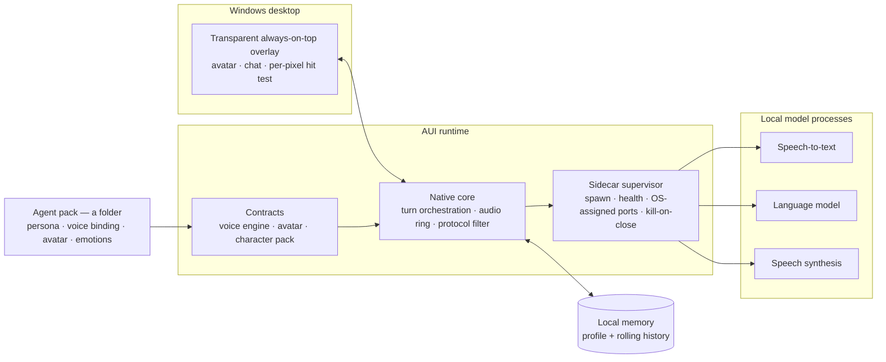
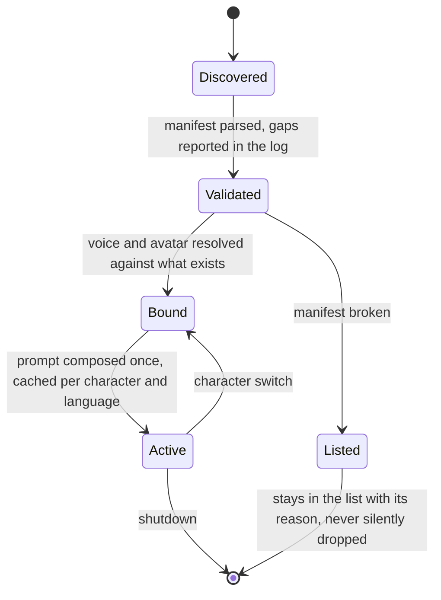

# Agentic User Interface Engine (AUI)

**Documentation-only repository. The source code is not public.**
*[Versione italiana](./README.it.md)*

---

## What it is

AUI is a Windows desktop runtime that hosts AI agents. An agent is a
folder: a manifest declaring who the character is, which voice it speaks with,
which avatar it wears and which emotions it can show. The runtime supplies
everything the folder does not — the local models, the audio pipeline, the
process supervision, the protocol and the security fence.

The reference point is Wallpaper Engine: a program that ships almost no content
of its own and instead runs what other people build. Same shape, different
payload.

Mia is the first agent running on it, and the product going to Steam. Speech
recognition, language model and speech synthesis all run as local processes on
the user's machine: no account, no cloud round trip, no subscription.

> [DA INSERIRE] 20–30 s demo video: one spoken turn — microphone, answer,
> lip-sync. · [DA INSERIRE] screenshot of the overlay on a real desktop.

---

## The problem

A local agent looks like one application and is not.

- **Three models, three lifecycles.** Speech-to-text, language model and
  synthesis are separate runtimes with incompatible dependency trees. Linked
  in-process, a model that dies takes the window with it.
- **VRAM is the budget, and it is shared.** A 4B model at 4 bits takes 3,396 MiB
  on an 8 GB card at 8k context (measured below). What is left has to be enough
  for the game in the other window.
- **The audio clock is a hard constraint.** Lip-sync is a timeline anchored to
  what the speakers actually played. Drift is visible on a face before it is
  measurable in a log.
- **The desktop is not a window.** A transparent always-on-top overlay decides,
  per pixel, whether a click belongs to the agent or to the desktop behind it.
- **One application hardcodes one character.** Changing voice, expressions or
  model means recompiling — which is what makes an assistant an app rather than
  a runtime.

The last point is why this is an engine; the others are why it is a runtime and
not a plugin. The app owns processes, protocol, timing and the security fence.
Everything a single-purpose app would hardcode is declared by the pack.

---

## Architecture



**Lifecycle of an agent.** Packs are discovered in two places — shipped with the
app, and installed by the user. A user pack with the same id wins, so a shipped
pack can be corrected without patching the app.



**One turn.**

```mermaid
sequenceDiagram
    participant U as User
    participant E as Engine
    participant S as Speech-to-text
    participant L as Language model
    participant T as Synthesis
    participant A as Avatar

    U->>E: push to talk; microphone captured into a ring buffer
    E->>S: audio
    S-->>E: transcript and detected language
    E->>L: persona + scene + app instructions + memory + rolling history
    L-->>E: token stream
    Note over E: a state machine splits the stream — what is spoken, what is only shown
    E-->>U: text appears while it streams
    E->>T: the spoken part, as soon as it is complete
    T-->>E: audio
    E->>A: viseme timeline, spread over the real audio duration
    E-->>U: voice and lip-sync, anchored to the audio hardware clock
```

**Memory**, today: a persisted profile — name, preferences, projects, recent
topics — injected into the prompt, plus a rolling conversation window capped by
a character budget rather than a turn count, so laconic turns do not collapse
continuity and long ones do not blow the context. The long-term layer is
designed and unwritten (see Roadmap).

---

## Key technical decisions

The section I would want to be interviewed on. Each one: what I chose, what I
rejected, what it cost.

**1. Rust and Godot — not Electron, not Unity, not a Python stack.**
Rejected: a webview with a Python backend (the category default: GC pauses and
IPC in the audio path), Unity (weight and licensing for a 2D overlay), Python
end-to-end (a 3–4 GB runtime in the installer, and a collector under the mouth).
*Cost:* a narrow FFI surface with its own traps, paid in code instead of latency.

**2. Models as local sidecars, not in-process bindings.**
The app owns the processes: spawned inside a Windows job object with
kill-on-close, so a crash cannot leave a multi-gigabyte model resident; ports
requested from the OS instead of fixed, so nothing collides; a CPU feature
preflight before each spawn, so an unsupported instruction set produces a message
instead of a silent crash.
*Cost:* serialization per call, and supervision becomes my problem.

**3. Threads and blocking calls, no async runtime — and cancellation by
generation id.**
The native layer lives inside the engine's frame loop, where an accidentally
initialized async runtime is a class of bug nobody wants to debug at 60 fps. Each
turn bumps a counter; the stream worker re-reads it per line and drops the
connection when superseded, so the model stops computing rather than being
ignored. Stopping drains three reservoirs at once: audio ring, playback buffer,
lip-sync state.
*Cost:* a call already in flight cannot be cancelled — a late synthesis is
discarded on return, so the user hears silence, not a stale line.

**4. The protocol belongs to the app, not to the pack.**
Plain text with a marker separating what is spoken from what is only shown; a
pure state machine splits the stream and strips markers before anything reaches
the user or the speakers. Imported third-party character cards have their
prompt-bearing fields discarded by design — an app that executes prompts shipped
inside content is injectable through content. Rejected: a grammar-constrained
JSON turn, which small models degrade badly under.
*Cost:* the model will get the format wrong, so the degradation ladder is code —
16 golden cases, each replayed at several stream chunk sizes, because a marker
split across two tokens is not a bug you find by hand.

**5. A voice engine is a manifest, not an integration.**
A folder declares how to launch it, how to ask, how to read the answer, which
voices it offers. Two shapes are implemented: a resident local server, and one
process per line. The proof is a backend made of a manifest and a short script,
no native code: it appears in the list, speaks, and lip-syncs, with nothing
recompiled. Every persisted format carries a schema version from day one —
readers migrate the previous one forward with a backup, and treat an unknown
future version as read-only.
*Cost:* the manifest must describe what a hardcoded integration would just do.

**6. Dropped the better-sounding synthesis engine for the small one, on numbers.**
The candidate with voice cloning measured RTF 2.01x and 6.8 s to first audio
against a 3–4 s target. Replaced by an 82M ONNX model that runs faster than real
time on CPU.
*Cost, accepted and written down:* no voice cloning in 1.0. The gain is
structural — synthesis leaves the VRAM budget entirely, and a 3–4 GB
Python/CUDA dependency leaves the installer with it.

**7. Lip-sync computed by the app, not supplied by the engine.**
Text to phonemes via an external grapheme-to-phoneme binary run as a separate
process (also the clean answer to its licence), mapped to viseme classes, spread
over the real audio duration. Any engine that returns audio gets lip-sync.
Rejected: requiring engines to emit phoneme timestamps — exactly one candidate
did.
*Cost:* proportional distribution is an approximation, not forced alignment; and
the port left two implementations of one algorithm alive, so a golden parity test
with a 5 ms tolerance exists to catch them drifting apart.

**8. The avatar sits behind a capability contract.**
The app says "look there", "this mouth pose", "happy". The backend declares what
the rig can do and receives only what it can apply, through one written
degradation table tested with the engine switched off: 16 phoneme classes, to
five vowel morphs, to two axes, to open-only. Rejected: one implementation per
rig format — three answers to the same question are three different bugs.
*Cost:* a compromise for every rig instead of the best mapping for one. The 3D
backend is what will actually prove the contract.

**9. Speak when the speech is complete, not when generation is finished.**
The protocol marker guarantees nothing after it will be spoken, so the moment the
filter enters display-only, no further sentence can reach synthesis. Measured:
first word from ~24.5 s to ~9.0 s, same turn, same machine. Per-sentence
chunking, which would also mask latency *inside* the answer, is on indefinite
hold: it broke the sync anchor, reopened a class of stale-audio bug, and split
prosody across calls.
*Cost:* no latency masking within the spoken part.

---

## Constraints and measured numbers

Development machine: i9-9900KF, RTX 2080 SUPER 8 GB, Windows 10.
Declared target: the Steam hardware survey median — 6–8 cores, 16 GB RAM, 8 GB
VRAM.

| Measure | Value | Source |
|---|---|---|
| VRAM, 4B model at 4 bits, 8k context, quantized KV cache | **3,396 MiB** — 2,495 model + 384 context + 517 compute | runtime memory breakdown, recorded test |
| VRAM per agent | one language model; synthesis runs on CPU by design, speech-to-text is CPU-only | design constraint |
| First word of a spoken answer | **~24.5 s → ~9.0 s**, same turn | before/after logs of the streaming rework |
| Speech-to-text, 2 s clip, small model on CPU | **3.95 s → 1.47 s** (~2.7x) after sizing the analysis window to the clip | recorded measurement |
| Rejected synthesis engine | RTF **2.01x**, first audio **6.8 s** vs a 3–4 s target | the benchmark that closed the decision |
| Lip-sync parity with the reference implementation | 10 phrases, tolerance **5 ms** | golden test in the suite |
| Per-pixel hit test, 800x700 overlay | GPU readback median **1.822 ms/frame** against a 0.300 ms budget; the geometric test it would replace: **1.033 ms/call** | instrumented run |
| Agreement between the two hit tests | **96.87%** over 19,312 sampled points, every disagreement in one direction | golden comparison |
| Model sizes on disk | LLM 3.1 GB · speech-to-text 190 MB · synthesis 326 MB + 28 MB voices | files |
| Audio ring / microphone ring | 20 s at 24 kHz, ~1.9 MB, lock-free SPSC / 180 s, ~35 MB at 48 kHz, raised from 60 s after a 70 s utterance was truncated | code |
| Test suite | **100 passed, 0 failed, 3 ignored, 2.02 s** | `cargo test`, 2026-09-15 |

The per-pixel hit test is how decisions get made here: written, measured, and
switched off, because it costs six times its budget and the cheaper method it
replaces is not free either. It ships when its gate opens, not on a date.

---

## Mia, the first agent

Everything a single-purpose assistant would hold in code, she declares:

```toml
schema_version = 1

[character]
id   = "mia"
name = "Mia"

[files]                       # persona, per language
it = "character.it.md"
en = "character.en.md"

[voice]                       # a binding, not an order: the user's choice wins
it = { backend = "kokoro", voice = "if_sara" }
en = { backend = "kokoro", voice = "af_heart" }

[emotions]                    # the single source of the emotion vocabulary
available = ["happy", "excited", "sad", "shy", "shocked", "angry", "neutral"]

[avatar]
type = "live2d"

[avatar.emotions]             # intent -> expression id, as the rig names it
happy   = "exp_02"
excited = "exp_04"
neutral = "exp_01"

[avatar.motion]
breath = 1.0
sway   = 0.6

[effects]                     # declared and empty, on purpose
```

- **The emotion vocabulary has one owner.** The same list feeds the prompt, the
  filter that recognizes the tag mid-stream, and the router that plays the
  expression. If the rig cannot render something the vocabulary promises, the
  parser says so in the log — in both directions.
- **Switching character rotates persona, voice and emotions together**, because
  they are three lines of one file.
- **A voice engine is added without touching the app.**
- **A broken pack does not break the app**: it stays listed, marked invalid, with
  the reason.

> [DA INSERIRE] Steam page link · [DA INSERIRE] 15 s clip of a character switch.

---

## Current state

**Working, verified by tests or by a recorded run.** Sidecar supervision: three
local model processes owned by the app, kill-on-close, OS-assigned ports, CPU
preflight, local crash log. Speech-to-text on a resident CPU-only server with a
command-line fallback. Streaming language turn with real cancellation, and a
prompt composed from pack, scene and app instructions — cached, and ordered so
the stable prefix survives the model's own cache. Manifest-driven synthesis, two
engine shapes, voice precedence user over pack over engine default, path fence on
everything a pack declares. Client-side lip-sync with a golden parity test.
Avatar contract plus a 2D backend, expressions coming from the manifest,
transparent click-through overlay with a per-pixel silhouette. Persisted profile
and rolling history. Chat surface and status strip, on the working branch.

**In progress.** The avatar extraction is done — the app no longer names the rig
format outside its backend — with two items left: the per-frame cost of the
geometric hit test, and excluding non-drawing interaction areas from the
silhouette. The per-pixel hit test is written and disabled, waiting on its gate.
Screen-level acceptance of the rebuilt scene is pending: there is no headless
engine here, so that verdict is a human one.

**Known debts, tracked.** Twenty-one open items, each recorded with where it was
verified. The two worth stating in public: the build still carries absolute
development paths, so the repository does not start unmodified on another
machine; and the language selector exists in code with nothing calling it, which
pins the current build to English.

---

## Roadmap

Not implemented. In execution order, each gated on a result rather than a date.

1. Procedural motion layer — breathing, micro-saccades, nods on the audio
   envelope. Gate: a blind A/B on five people, four out of five.
2. 3D avatar as a second backend — the real test of the avatar contract.
3. Sidecar supervisor as its own subsystem: health sweeps, restart policy,
   suspend and resume.
4. GPU orchestrator and simultaneity tests — the remaining VRAM war is the
   language model against whatever game is running.
5. Long-term memory: a plain-text vault the user owns and can read outside the
   app, with a local index. Designed, no code.
6. Chat GUI as a specified subsystem; settings, multi-monitor and DPI.
7. Security, compliance and first run, including a hard licensing gate before any
   release build.

After 1.0: open microphone with cascaded voice detection, wake word, mid-sentence
emotion changes, contextual awareness, and optional cloud offload with the user's
own key — never silently, with three explicit modes.

---

## Method

Development is AI-assisted: I use Claude Code as the implementation tool.

Mine is the architecture, the constraints, the specification and the direction —
what gets built, in what order, what counts as accepted, what is rejected and
why. Work is specified in numbered work orders with their own acceptance criteria
before it is written; deviations are recorded the day they are taken, with the
reason, and so are the options considered and refused, so they do not come back.

The part that matters is the verification discipline. Nothing is called done
without a test, a measurement or a named human verdict, and the things only a
person can judge — whether a mouth looks like speech, whether an interruption
sounds instant — stay open with a name on them instead of being quietly assumed.
Every number in this document comes from a test, a log or a recorded measurement
on the machine above.

> [DA INSERIRE] contact link.

---

© 2026 Alejandro Lopez. Documentation only: this repository distributes no source
code, no binaries and no assets. All rights reserved.
